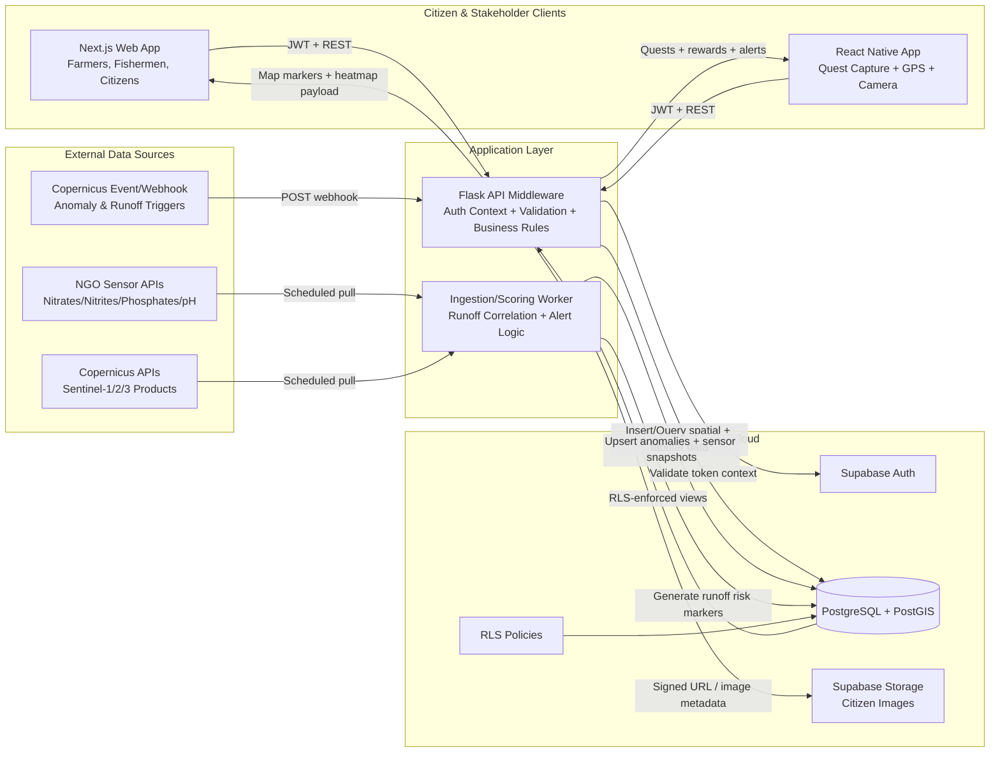

# DanubeGuard OS - System Architecture & Data Flow

## Microservices Architecture (Mermaid)

## Primary Data Flow

1. Mobile users submit anomaly reports (photo metadata, EXIF timestamp, coordinates) to Flask.
2. Flask validates payloads, calls Supabase RPC helpers, stores report records in PostGIS, and awards tokens.
3. Copernicus webhook and scheduled pulls feed anomaly/runoff predictions into Flask ingestion endpoints.
4. NGO sensor feeds are normalized by worker jobs and stored as geolocated measurements.
5. Web frontend requests map payloads from Flask, which aggregates reports, anomalies, and sensors into one response.
6. Supabase RLS protects user-owned data while keeping approved environmental map layers publicly readable.
